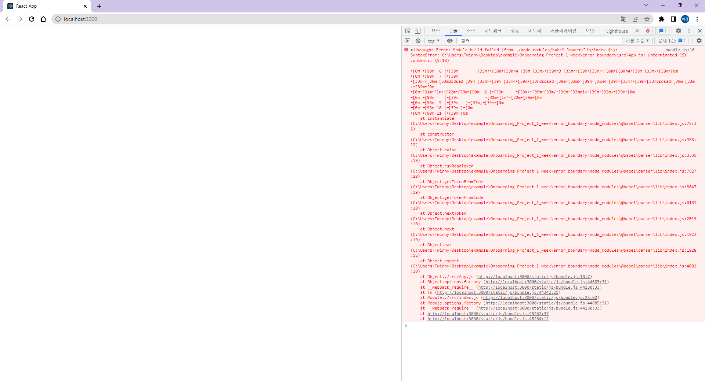
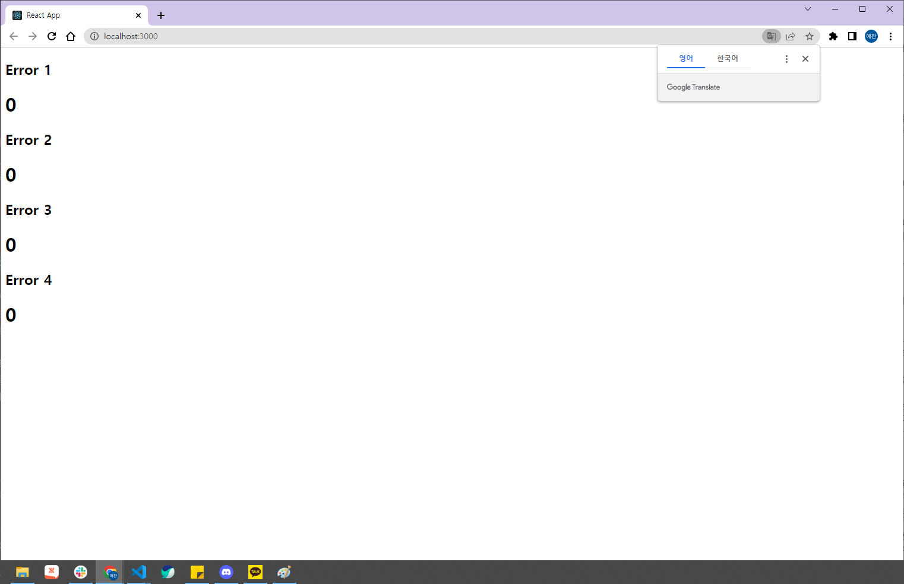
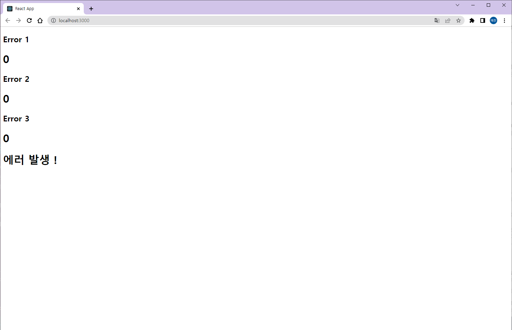
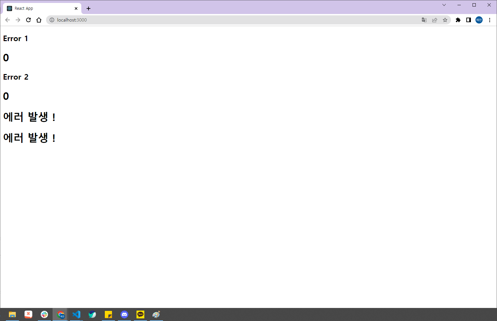
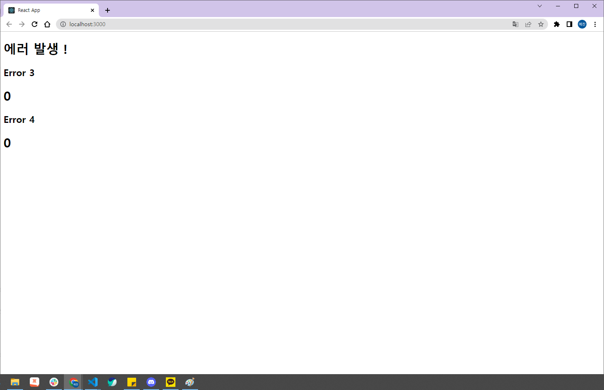

# **Error Boundary (에러 경계)**

## [공식문서](https://ko.reactjs.org/docs/error-boundaries.html)

</br>

## **목차**

### 1. [소개](#소개)
### 2. [사용하게 된 이유](#사용하게-된-이유)
### 3. [사용 방법](#사용-방법)
### 4. [장점](#장점)
### 5. [예외 상황](#예외-상황)
* [이벤트 핸들러](#이벤트-핸들러)
* [비동기적 코드](#비동기적-코드)
* [서버 사이드 렌더링](#서버-사이드-렌더링)
* [자기 자신의 에러](#자기-자신의-에러)
</br>

## **소개**
React 16 에서 처음 도입된 개념으로 , 그 전까지는 UI component의 일부분에서 문제가 발생하면 자바스크립트 에러가 전체 애플리케이션을 중단시켰습니다. 잘못된 정보를 보여주는 것보다 보여주지 않는게 낫다고 생각하기 때문입니다. 다만 이는 좋은 사용자 경험이라고 말할 수는 없습니다.


<center>에러가 발생해서 컴포넌트가 중단된 모습</center>  

</br>

component 하나에서 문제가 발생했지만 , 전체 애플리케이션이 중단되는 불상사가 일어납니다. 이런 문제를 해결하기 위해 React 16에서는 Error Boundary라는 새로운 개념이 도입되었습니다.

Error Boundary는 하위 component 트리의 어디에서든 자바스크립트 에러를 기록하며 깨진 컴포넌트 트리 대신 폴백 UI를 보여주는 component 입니다. 쉽게 말하면 , 에러가 있는 component는 폴백 UI를 대신 보여주어서 전체 애플리케이션이 중단되지 않게 하는 개념입니다.

</br>

## **사용하게 된 이유**
Error Boundary를 사용하지 않았을 때 , 내부 로직에서 오류가 생기면 페이지 전체가 백지로 표시되어 버리는 이슈가 있습니다. 그때 Error Boundary를 사용하게 되면 , 특정 로직에 오류가 발생해도 페이지 전체가 백지가 되는 것이 아닌 , 대체 UI를 표시할 수 있습니다.


<center>정상적인 화면</center>

</br>

카운터가 5로 증가하면 에러를 표시하는 counter를 표시하는 화면입니다. 현재는 모두 0이므로 에러가 표시되지 않습니다. 이 때 특정 counter가 5가 되면


<center>Error4에 에러가 발생한 모습</center>

</br>

에러 발생 ! 이라는 폴백 UI를 표시하게 됩니다. 만약 Error Boundary를 사용하지 않는다면 , 전체 화면이 백지로 표시될 것입니다. 하지만 Error Boundary를 사용해서 특정 component에서 폴백 UI를 표시하게 됩니다.

</br>

## **사용 방법**
Error Boundary가 표시되길 원하는 특정 component를 감싸주기만 하면 됩니다. 또한 무조건 1개만 감싸야 하는 것은 아닙니다. 여러 component를 감쌀수 도 있습니다.

```js
<ErrorBoundary>
    <Component1 />
</ErrorBoundary>
```
```js
<ErrorBoundary>
    <Component1 />
    <Component2 />
</ErrorBoundary>
```
</br>

## **장점**
가장 큰 장점으로는 특정 로직에 에러가 발생해도 전체 페이지에 영향을 주지 않아서 페이지가 백지로 표시되지 않는 장점이 있습니다. 특정 component에 에러가 발생해도 , 그 component가 가진 기능 외에 다른 기능은 사용 가능합니다. 또한, 개발자의 의도에 따라서 배치할 수 있다는 장점이 있습니다.


<center>Error3, Error4에 에러가 발생한 모습</center>

</br>

Error 3과 Error 4에 에러가 발생한 모습입니다. 이렇게 각각의 component 에러가 발생했다는 것을 표시할 수 있을 뿐만 아니라 여러 component중 하나만 에러가 발생해도 폴백 UI를 표시할 수 있습니다.


<center>Error1 또는 Error2에 에러가 발생한 모습</center>

</br>

Error 1 또는 Error 2 둘 중 하나만 에러가 발생해도 , 한번에 폴백 UI를 표시할 수 있습니다. 개발자가 의도에 따라 배치할 수 있습니다.


</br>

## **예외 상황**
공식 문서에서는 아래 4가지 경우에는 , Error Boundary가 에러를 포착하지 않는다고 말하고 있습니다.

</br>

### **이벤트 핸들러**
Error Boundary는 렌더링 시 발생하는데 , 이벤트 핸들러는 렌더링 시 발생하지 않기 때문에 이벤트 핸들러에서 에러를 던지더라도 포착하지 않습니다. 이벤트 핸들러 내의 오류를 잡아야 한다면 , try / catch 문을 사용하도록 권장하고 있습니다. 즉 , Error Boundary는 렌더링 중에 일어나는 하위 component에게서 발생하는 예외를 처리합니다.

</br>

### **비동기적 코드**
setTimeout 등의 콜백과 같은 비동기적 코드에서는 에러를 포착하지 않습니다. 에러가 발생하더라도 , 화면은 정상적으로 작동합니다.

</br>


### **서버 사이드 렌더링**

</br>


### **자기 자신의 에러**
Error Boundary 자체에서 발생한 에러는 잡을 수 없습니다. Error Boundary는 하위 component에서 발생하는 에러를 처리하기 때문입니다. 다만 상위에 Error Boundary가 있다면 그 위치에서 Error Boundary가 실행될 수 있습니다.
</br>


